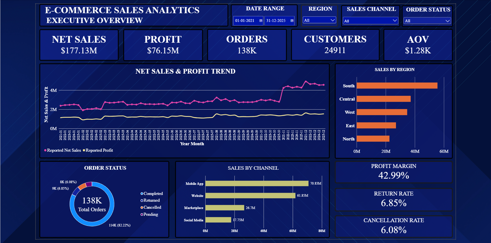
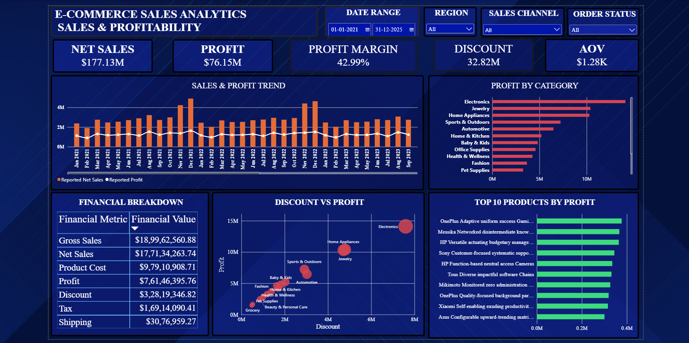
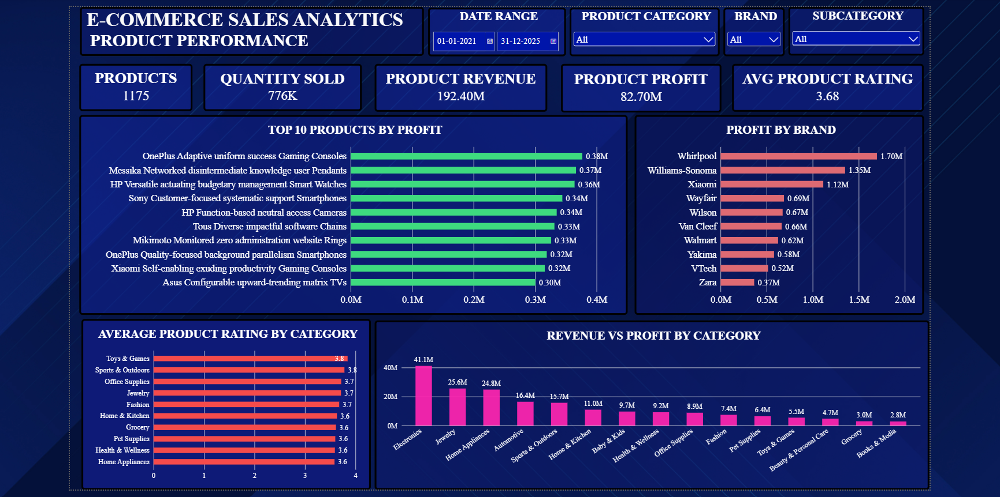
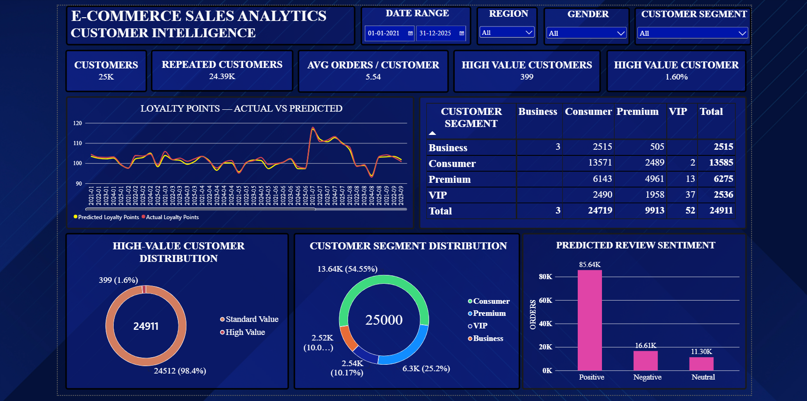
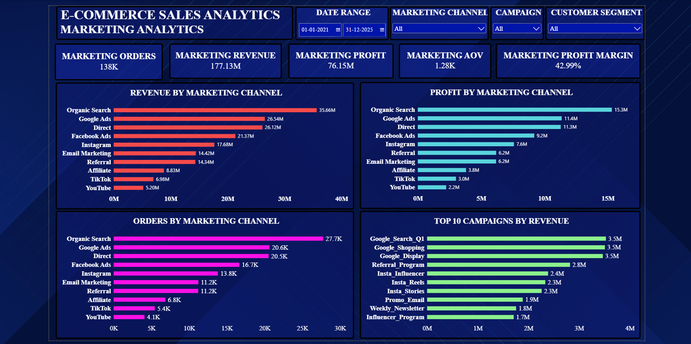
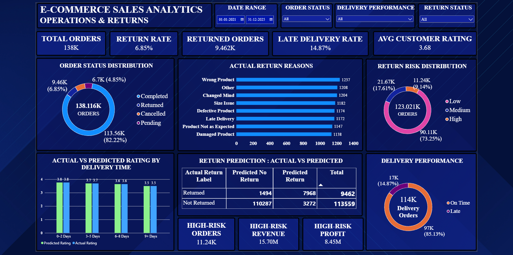

# 📊 Power BI Analytics Dashboard — E-Commerce Sales & ML Insights

> **An Enterprise-Grade Interactive Analytics & Predictive Intelligence Suite**  
> Connecting descriptive sales metrics, customer behavioral analytics, supply chain operations, and machine learning outputs into actionable executive and operational dashboards.

---

## 📌 Executive Overview & Project Description

The **Power BI Analytics Dashboard** serves as the primary visual intelligence hub for the **E-Commerce Sales Analytics & ML Platform**. Built in **Microsoft Power BI Desktop**, this report synthesizes large-scale historical transaction data, customer profiles, product catalogs, and machine learning inference outputs generated by the Python predictive pipeline.

### Key Objectives & Highlights
* **Unified Business Metrics**: Instant visibility into Revenue, Net Profit, Profit Margin %, Customer Lifetime Value (CLV), CAC, ROAS, and Logistics SLAs.
* **Predictive AI Integration**: Seamless ingestion of Python ML model outputs including **Order Return Risk (XGBoost/LightGBM)**, **Customer RFM Segmentation (K-Means)**, **Delivery Delay Flags**, **Customer Loyalty Predictions**, and **Sentiment Ratings**.
* **Role-Based Navigation**: 6 tailored dashboard views built specifically for C-suite Executives, Sales Directors, Category Managers, Marketing Strategists, and Supply Chain Leads.
* **Advanced Data Modeling**: Optimized Star-Schema structure featuring high-performance DAX measures, time-intelligence calculations, and dynamic parameter slicers.

---

## 📂 Dashboard Directory Structure

```text
dashboard/
├── 📄 E-Commerce-Sales-Analytics.pbix      # Main Power BI Report file (.pbix)
├── 📁 images/                              # High-resolution dashboard page visual showcases
│   ├── executive-overview.png             # 1. Executive Overview & Strategic KPIs
│   ├── sales-profitability.png            # 2. Sales, Margin & Profitability Deep-Dive
│   ├── product-performance.png            # 3. Product Catalog, SKU & Rating Insights
│   ├── customer-intelligence.png          # 4. Customer Segmentation & Value Analytics
│   ├── marketing-analytics.png            # 5. Marketing Channel & Campaign Analytics
│   └── operations-returns.png             # 6. Logistics Operations & ML Return Risk
└── 📄 README.md                            # Comprehensive Dashboard Documentation (This file)
```

---

## 🖼️ Detailed Explanation of Dashboard Pages & Visual Showcase

The Power BI report contains **6 interactive pages**, each designed to address specific operational and strategic analytical needs.

---

### 1. 📈 Executive Overview

#### 🎯 Purpose
Serves as the central command screen for C-level executives and general managers. It summarizes macro financial performance, sales trajectories against business targets, and global regional revenue footprint.



#### 📊 Core KPIs & Metrics
* **Total Sales Revenue**: Aggregated Gross Sales ($) across all order lines.
* **Net Profit**: Net earnings after factoring product costs, shipping, discounts, and return adjustments.
* **Profit Margin %**: Ratio of Net Profit to Gross Sales.
* **Total Orders & AOV**: Total completed order count and Average Order Value ($).

#### 🔍 Visual Components Breakdown
1. **Executive KPI Header Cards**: Dynamic single-value visual cards showing current performance metrics with period-over-period trend indicators.
2. **Monthly Revenue Trend vs Target (Line & Clustered Column)**: Tracks monthly revenue performance against strategic revenue targets.
3. **Regional Sales Distribution Map / Heatmap**: Geographic visualization highlighting top-performing territories, countries, and states.
4. **Category Revenue & Margin Matrix**: High-level breakdown of sales revenue and gross margin grouped by primary product categories.

#### 💡 Key Business Value
Provides leadership with instant situational awareness of revenue trajectories and high-level profitability drivers without navigating through granular transactional details.

---

### 2. 💰 Sales & Profitability Analytics

#### 🎯 Purpose
Delivers a deep-dive financial assessment of revenue streams, profit margins, discount leakage, and transaction types to identify profit optimization opportunities.



#### 📊 Core KPIs & Metrics
* **Gross Revenue vs Net Margin %**: Financial comparison of total top-line sales versus bottom-line retention.
* **Discount Impact ($)**: Total monetary discounts conceded across campaigns and promotions.
* **Average Profit Per Order**: Unit economics metric evaluating order profitability.

#### 🔍 Visual Components Breakdown
1. **Profit Margin by Product Category (Waterfall / Bar Chart)**: Identifies high-margin vs low-margin/loss-leader product groups.
2. **Discount vs Profit Margin Scatter Correlation**: Evaluates whether aggressive discounting negatively impacts total net profitability.
3. **Payment Method Breakdown (Donut Chart)**: Distribution of transactions across Credit Card, PayPal, Buy-Now-Pay-Later (BNPL), and Net Banking.
4. **Regional Profitability Breakdown (Heatmap / Matrix)**: Regional profitability matrix identifying geographic areas with disproportionate shipping costs or return rates.

#### 💡 Key Business Value
Helps sales directors and financial analysts spot discount erosion, optimize pricing strategies, and promote high-margin payment channels.

---

### 3. 📦 Product Performance & Inventory Insights

#### 🎯 Purpose
Monitors individual SKU performance, category sales trends, customer review scores, and product return volume to optimize merchandise strategy and stock allocation.



#### 📊 Core KPIs & Metrics
* **Total Units Sold**: Total volume of physical products fulfilled.
* **Top Category Revenue**: Revenue generated by the #1 selling product category.
* **Average Product Rating**: Star-rating average across all customer feedback reviews.
* **Active SKU Count**: Total count of active catalog products generating sales.

#### 🔍 Visual Components Breakdown
1. **Top 10 Best-Selling Products (Horizontal Bar Chart)**: Highlights top revenue and volume generating SKUs.
2. **Revenue vs Rating Scatter Plot**: Analyzes the relationship between customer satisfaction (ratings) and overall sales performance.
3. **Category Returns vs Gross Sales (Dual-Axis Chart)**: Cross-references high-volume product categories against their corresponding return rates.
4. **Brand Performance Matrix Table**: Detailed grid displaying units sold, average price, rating, return rate, and profit by brand.

#### 💡 Key Business Value
Empowers inventory planners and category managers to restock top performers, prune poor-rated SKUs, and renegotiate supplier terms for high-return items.

---

### 4. 👥 Customer Intelligence & Segmentation

#### 🎯 Purpose
Combines traditional RFM (Recency, Frequency, Monetary) analytics with **Python Machine Learning (K-Means Clustering)** to visualize customer cohorts, retention, and lifetime value.



#### 📊 Core KPIs & Metrics
* **Total Active Customers**: Count of unique purchasing customers in the reporting period.
* **Customer Lifetime Value (CLV)**: Projected monetary value of customer relationships.
* **Repeat Order Rate %**: Percentage of customers with more than 1 purchase.
* **VIP / High-Value Customer Count**: Count of customers classified into top spending tiers.

#### 🔍 Visual Components Breakdown
1. **Machine Learning Cluster Distribution (Donut / Treemap)**: Visualization of ML-segmented cohorts (**Champions/VIP, Loyal Customers, At-Risk, Hibernating**).
2. **RFM Score Grid & Distribution**: Visual scoring Matrix rating customer recency, frequency, and monetary behavior.
3. **Customer Acquisition YoY Growth (Line Chart)**: Tracks new customer sign-ups and first-time purchase rates over time.
4. **Segment Spend Distribution (Stacked Bar Chart)**: Breakdown of total revenue contributed by each customer segment.

#### 💡 Key Business Value
Enables marketing and CRM teams to design hyper-targeted retention campaigns, re-engage churn-risk customers, and reward high-value VIP cohorts.

---

### 5. 🎯 Marketing & Channel Analytics

#### 🎯 Purpose
Evaluates marketing spend efficiency, acquisition channel performance, campaign conversion metrics, and return on marketing investments.



#### 📊 Core KPIs & Metrics
* **Customer Acquisition Cost (CAC)**: Average spend required to acquire a single paying customer.
* **Return on Ad Spend (ROAS)**: Revenue generated per dollar spent on advertising.
* **Total Marketing Budget Spent**: Aggregated marketing expenditure across digital channels.
* **Conversion Rate %**: Percentage of channel visits resulting in completed orders.

#### 🔍 Visual Components Breakdown
1. **Revenue by Marketing Channel (Funnel / Bar Chart)**: Performance breakdown across Organic Search, Paid Search, Social Media, Email, and Affiliate channels.
2. **Campaign ROAS & Conversion Comparison (Clustered Bar Chart)**: Head-to-head comparison of ad campaigns by conversion volume and ROAS.
3. **Acquisition Channel Trend Over Time (Area Chart)**: Tracks seasonal shifts in customer acquisition traffic by channel.
4. **Cost per Acquisition (CPA) by Channel Matrix**: Table displaying spend, acquisition volume, revenue, and calculated CPA.

#### 💡 Key Business Value
Guides marketing budget allocation toward high-ROAS channels and flags underperforming campaigns to prevent ad spend waste.

---

### 6. 🚚 Operations, Logistics & Returns Management

#### 🎯 Purpose
Focuses on supply chain operations, shipping carrier performance, delivery delays, and **ML-Powered Return Risk Predictions**.



#### 📊 Core KPIs & Metrics
* **Overall Return Rate %**: Percentage of total orders marked as returned.
* **High-Risk Return Order Count**: Count of pending orders flagged with >70% ML return probability.
* **Average Delivery Delay**: Mean delay duration (in days) beyond estimated delivery dates.
* **On-Time Delivery Rate %**: SLA fulfillment percentage across logistics partners.

#### 🔍 Visual Components Breakdown
1. **ML Return-Risk Score Distribution (Histogram / Risk Bands)**: Categorizes incoming orders into Low, Medium, and High Return Risk cohorts.
2. **Delivery Delay Warnings by Carrier (Clustered Column Chart)**: Compares shipping carriers (DHL, FedEx, UPS, Postal) on delay frequencies and lead times.
3. **Return Reason Breakdown (Pie / Donut Chart)**: Displays proportion of returns caused by size mismatch, defective item, late delivery, or buyer remorse.
4. **Predicted vs Actual Returns by Product Category**: Evaluates ML prediction accuracy against historical actual return numbers.

#### 💡 Key Business Value
Provides logistics and operations leads with proactive warnings to intercept high-risk orders, optimize carrier selection, and mitigate return-related losses.